# PDF Analysis

This is report containing pdf analysis of certain textbooks present on the Internet.

Note: I tried to identify possible problems with each textbook, and report only one instance of that type of issue. Throughout textbooks each problem could appear more frequently than once.

## Grinstead and Snell’s Introduction to Probability

[Textbook](../../test/prob.pdf).

### General Analysis

Pages: 518

Digital PDF: Yes

Contains:
- formulas
- diagrams
- images
- tables

Expected difficulty: Medium

### Problematic pages

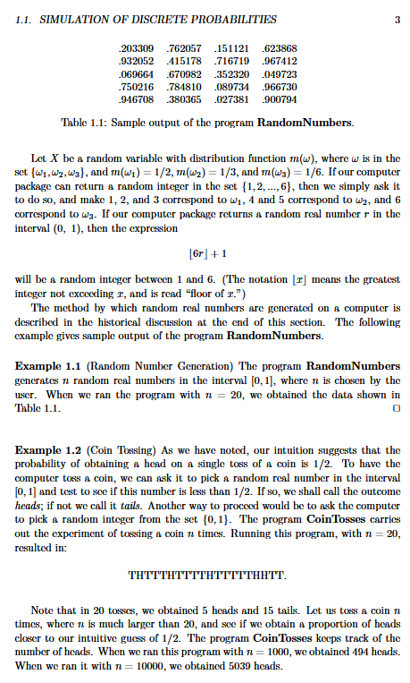

Reason: ambiguous table, may be mistaken by regular LaTeX formula.

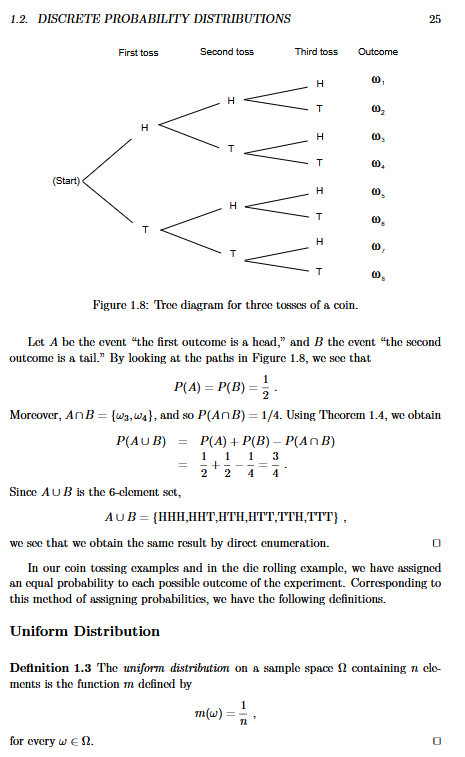

Reason: this diagram could be interpreted as LaTeX formula instead of a regular image.

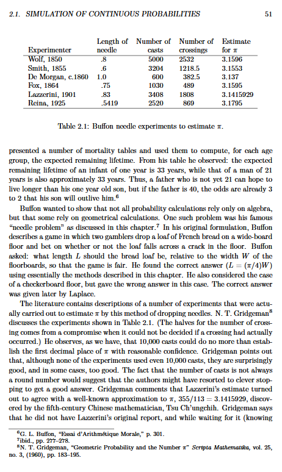

Reason: ambiguous table, there is no clear separation of columns and rows.

## Read and Complex Analysis

[Textbook](../../test/rudin.pdf).

This book contains many dense LaTeX formulas, which could be extracted incorrectly.

### General Analysis

Pages: 433

Digital PDF: Yes

Contains:
- formulas

Expected difficulty: Easy

### Problematic pages

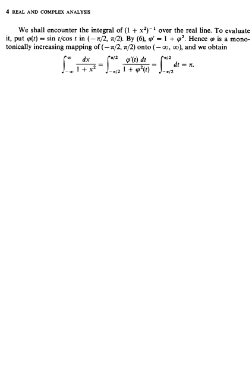

Reason: there is a posibility for illformed LaTeX formula.

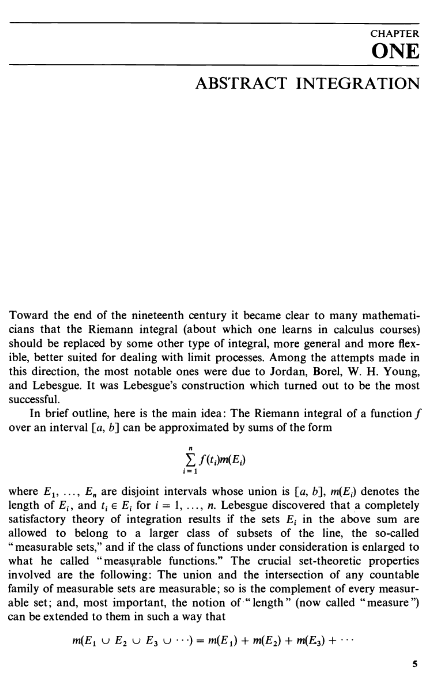

Reason: Chapter indication could be interpreted not as intended.

## Set theory and the continuum hypothesis

[Textbook](../../test/conti.pdf).

### General Analysis

Pages: 160

Digital PDF: No

Contains:
- formulas
- tables

Expected difficulty: Hard

### Problematic pages

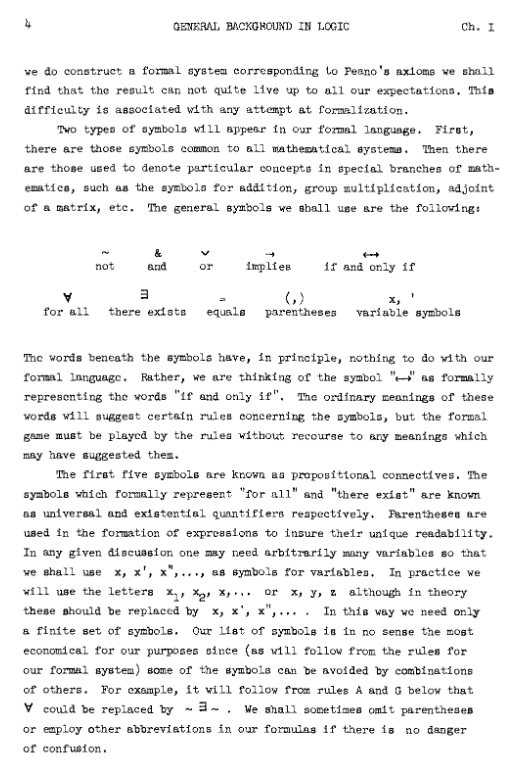

Reason: page contains irregular LaTeX formula.

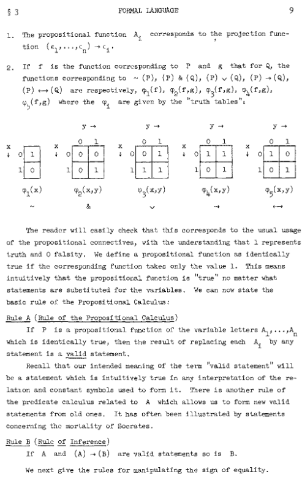

Reason: table could be extracted incorrectly

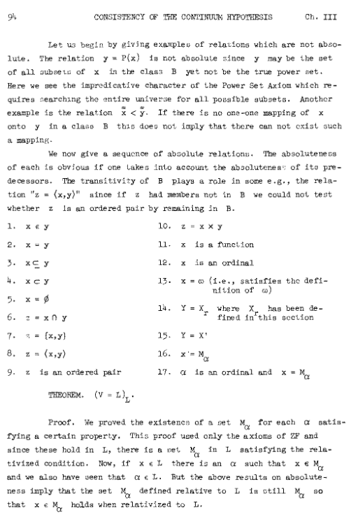

## A First Course in Probability

[Textbook](../../test/a_first_course_in_probability.pdf)

### General Analysis

Pages: 848

Digital PDF: Yes

Contains:
- formulas
- diagrams
- images
- tables

Expected difficulty: Hard

### Problematic pages

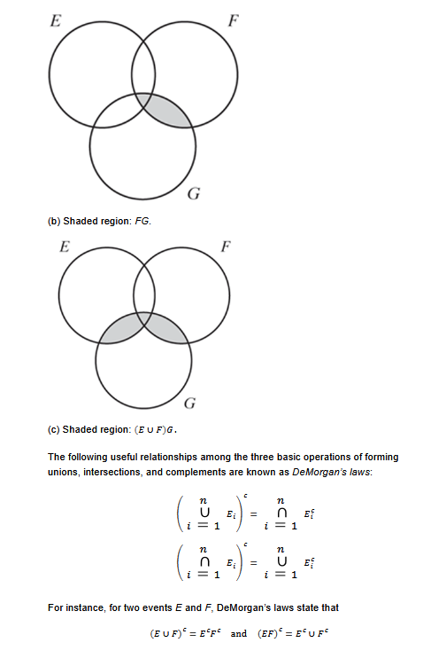

Reason: "i = 1" is bigger than usually, in that book.

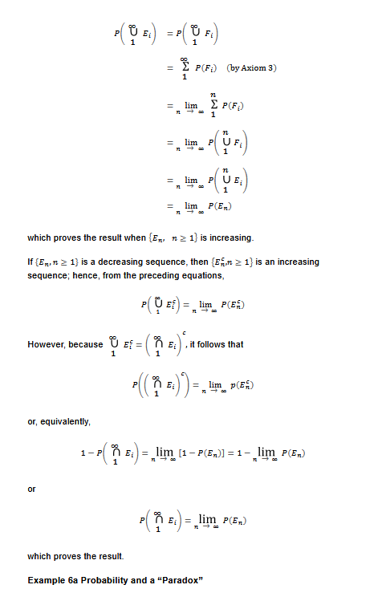

Reason: symbols are misaligned, this could pose a threat to correct formula extraction.

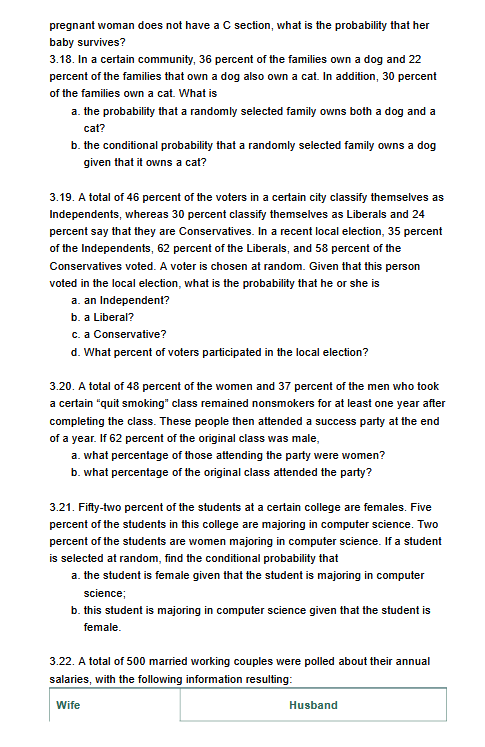
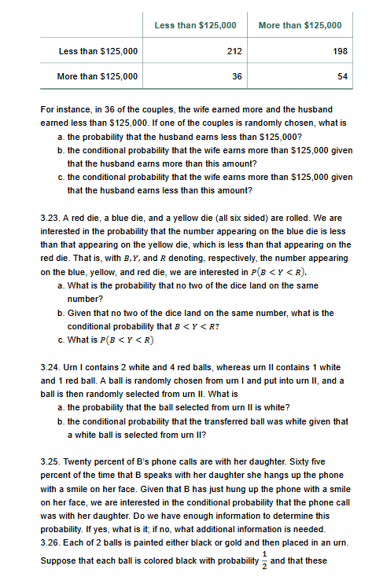

Reason: can be extracted as two distinct tables.

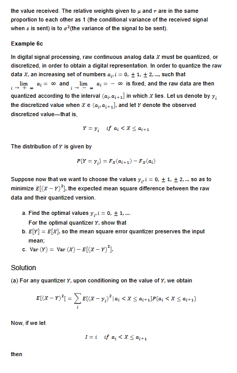

Reason: "i -> - infty" could be interpreted incorrectly.

# Conclusion