# PDF Patterns

This report will contain summarization of all patterns which are present in certain textbooks.

## Grinstead and Snell’s Introduction to Probability

[Textbook](../../test/prob.pdf).

### Contents

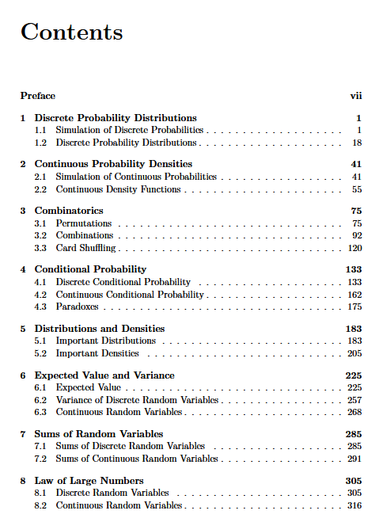
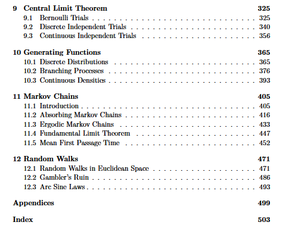

### Chapters

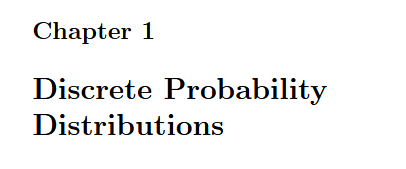
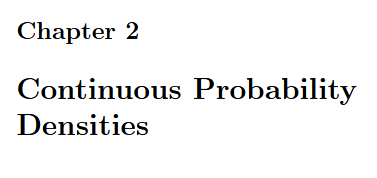
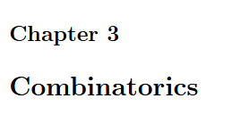
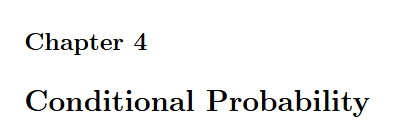
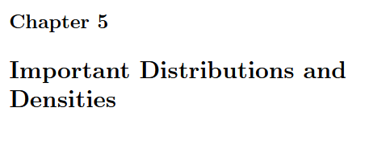

### Sections

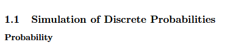
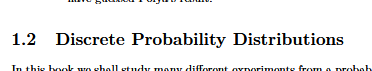
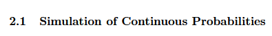
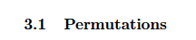
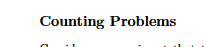

### Examples

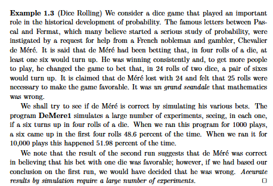
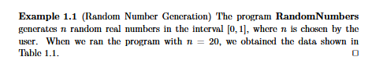
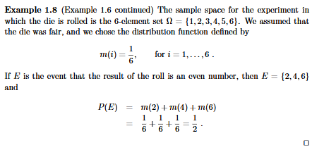
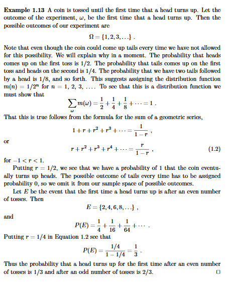
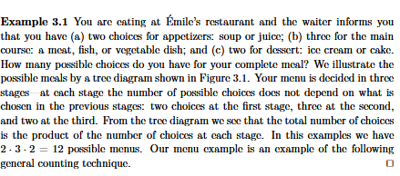

### Theorems

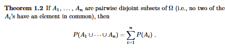
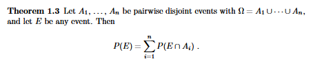
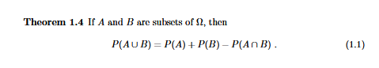
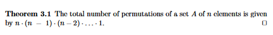
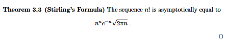

### Corollaries

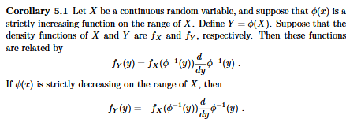
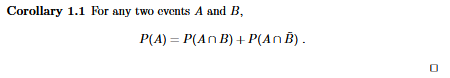
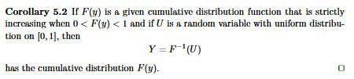
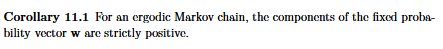

### Proofs

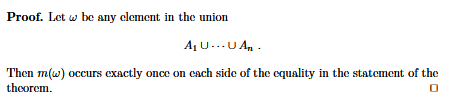
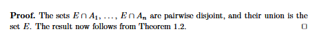
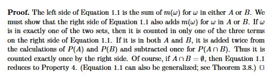
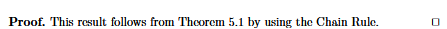
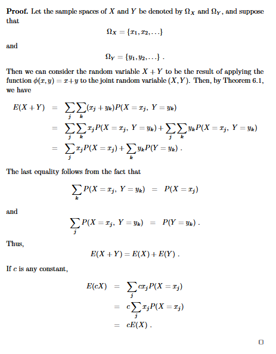

### Exercises

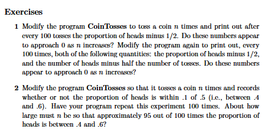
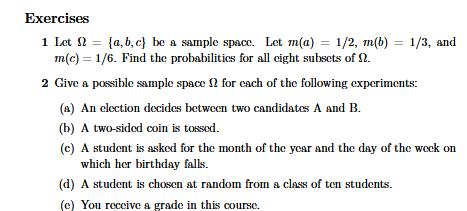
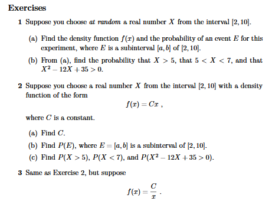
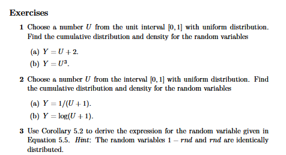
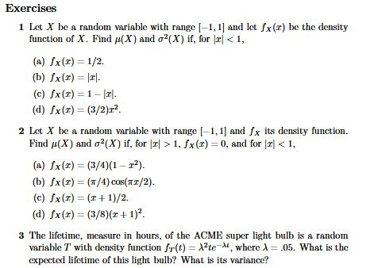

### Diagrams

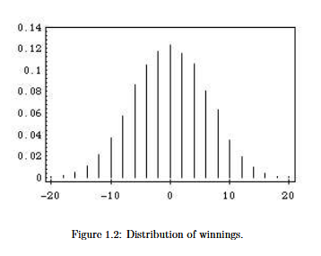
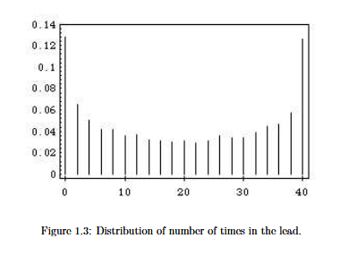
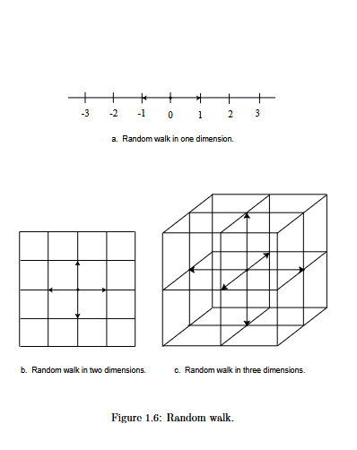
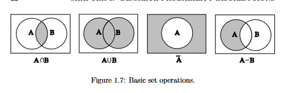

### Tables

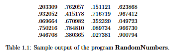
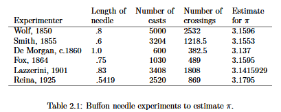
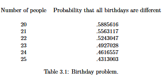
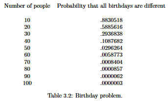
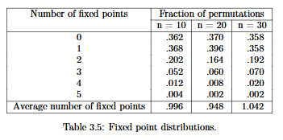

### Footnotes

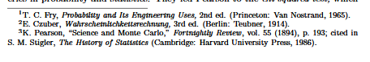
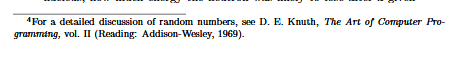
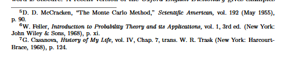

### Pattern Summary

Based on textbook, I conclude, that these patterns are gonna be useful for later stages of parsing:
1. On page, where new chapter starts, has page counter on the bottom of the page. On other pages page counter and title of current chapter located at the top of a page.
2. If any diagrams present, the are located on top of the page.
3. Definitions, examples, proofs and theorems, corollaries, if not followed by proofs, end with square.
4. Each exercises section made out of numerical list.
5. Footnotes located on the bottom of the page, which separated with text by long line.
6. Each section header is large. Each subsection header is slightly smaller that section's header, but bigger that usual text.

## Real and Complex Analysis

[Textbook](../../test/rudin.pdf).

### Chapters

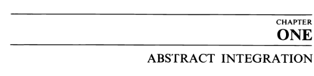
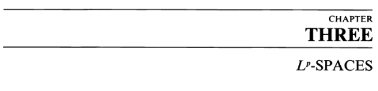

### Sections

### Examples

### Definitions

### Statements

### Proofs

### Exercises

### Footnotes

### Pattern Summary

Based on textbook, I conclude, that these patterns are gonna be useful for later stages of parsing:
1. Page layout:
    -  On page, where new chapter starts, has page counter on the bottom of the page. On other pages page counter and title of current chapter located at the top of a page.
2. Theorems and proofs:
    - Theorems, Propositions, Lemmas, Corollaries written in italic.
    - After statement in italic, regular text may appear before proof.
    - Proof ends with "////".
3. Book separated on segments which are numbered, section headers just separate them, and do not influence the counter. Only when a new chapther begins, counter resets.

## A First Course in Probability

[Textbook](../../test/a_first_course_in_probability.pdf).

### Chapters

### Sections

### Notation

### Statements

### Proposition

### Theorems

### Proofs

### Examples

### Solutions

### Figures

### Exercises

### Pattern Summary

Based on textbook, I conclude, that these patterns are gonna be useful for later stages of parsing:
1. Each page have page counter on the bottom. 
2. Each section is a blue-like or black large text.
3. Propositions, proofs, examples, theorems written in bold, followed by regular text.
4. On top of the each figure and table some text in bold is written ("Figure ..." or "Table ..." respectively).