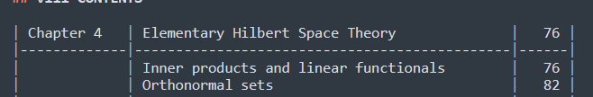
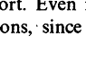

# Tool Comparison

In this report I gonna compare tools for data extraction from pdf textbooks.

## Tools

- Docling
- Marker
- PyMuPDF

### Scripts

#### Page Selector

In order to select sample pages I wrote script which does just selects pages without changing structure of page.

To select pages run following command from top-level directory of project:
```bash
python scr\pageselector.py <input_pdf> <output_pdf> <pages>  
```

`<input_pdf>` - path to input .pdf file;
`<output_pdf>` - path to output .pdf file;
`<pages>` - page numbers which should be included in output file. numbers separated with spaces.

For example:

```bash
python scr\pageselector.py resources\test\rudin.pdf "resources\reports\Tool Comparison\samples\rudin-samples.pdf" 8 9 14 15 16 19 20 23 36 46 51 78
```

#### Docling

Docling script is a script which converts pdf to markdown file using docling.

To run docling script, run following command:
```bash
python scr\docling-script.py <input_pdf> <output_pdf> [--method <METHOD>]
```

`<input_pdf>` - path to input .pdf file;
`<output_pdf>` - path to output .pdf file;
`<METHOD>` - one of:
- `default` - default configuration for docling package;
- `no_ocr` - configuration which better for math texts without using ocr;
- `default_ocr` - configuration which uses default ocr settings;
- `easy_ocr` - configuration which uses specifically EasyOCR engine.

By default, if no ocr engine present, docling uses RapidOCR.

#### Marker

#### PyMuPDF

## Books

In order to check tools performance, I chose sample pages (pdf file with selected pages) which represent each problem with each textbook. Table contains page numbers I chose and what will I look for.

### Output comparison

What do I require from output:
- Text present on sample pages should appear without any changes, in order from top to bottom, from left to right (not applied to formulas). The only changes allowed:
    - Hyphenations in sample pages must be replaced with regular words; 
- Text with emphasis (bold, italic, etc) should appear with the same emphasis as in sample pages;
- All tables, diagrams, formulas should be appear the same as in sample pages:
- Any inline math or formulas should be wrapped with `$..$` or `$$..$$` and should not be replaced with unicode equivalents (especially in inline math).

When I am checking how well specific tool extracted data from sample pages, I reading from top to bottom of each document (markdown output and pdf sample pages) and leaving notes like: `ACC(<line numbers>): ...`, `DEN(<line numbers>): ...`, `NOTE(<line numbers>): ...`.

What each abbriviation means:
`ACC` (accepted) - part of output which matches my requirements;
`DEN` (denied) - part of output which doesn't match my requirements;
`NOTE` (noted) - part of output which I don't require, but I acknowledged of.
`line number` - line number in output where I made some notice.

### Real and Complex Analysis

[Textbook](../../test/rudin.pdf).

[Sample pages](./samples/rudin-samples.pdf).

|Page|Reason|
|:---|:-----|
|8   |"CONTENTS", contents, "vii" (page counter)|
|9   |"viii CONTENTS" (page counter), contents|
|14  |"PREFACE", regular text (with inline LaTeX), "xiii" (page counter)|
|15  |"xiv PREFACE" (page counter), regular text (with inline LaTeX)|
|16  |"PROLOGUE", "THE EXPONENTIAL FUNCTION", formulas, Theorem (bold and italic text), "1" (page counter)|
|19  |Problematic page, "4 REAL AND COMPLEX ANALYSIS" (page counter), formulas|
|20  |"CHAPTER", "ONE", "ABSTRACT INTEGRATION", "5" (page counter)|
|23  |"8 REAL AND COMPLEX ANALYSIS" (page counter), "The Concept of Measurability" (header), Definitions|
|36  |"ABSTRACT INTEGRATION 21" (page counter), "1.26 Lebesgue's Monotone Convergence Theorem"|
|46  |"ABSTRACT INTEGRATION 31" (page counter), Theorem, Exercises, smaller text|
|51  |"36 REAL AND COMPLEX ANALYSIS", theorems and proofs, footnote|
|78  |"$L^{p}$-SPACES 63", formulas|

#### Docling - default configuration (RapidOCR)

[Parsing result](./outputs/rudin-samples.md).

##### Comparison

NOTE(1): "CONTENTS" was given `##`.

DEN(5): Table misses "1" opposite to "Prologue: The Exponential Function".

DEN(11): "[0, 00]" _instead of_ "$[0, \infty]$".

DEN(24, 26, 52): "LP" _instead of_ "$L^{p}$".

NOTE(32): "viii CONTENTS" was given `##`.

DEN(44, 72): "LI" _instead of_ "$L^{1}$".

DEN(45): "Bana.eh" _instead of_ "Banach".

NOTE: Generally table of contents was generated well enough. Although there is where docling decided to do this:


Since docling decided from start, that this should be a table, it could not what top entries should be.

DEN(79): "th     l  so    ,    hh" _instead of_ "theorem allow one to "guess" the Poisson integral formula. They team up in the" (entire row in pdf was incorrectly extracted)

DEN(79): "L²" _instead of_ "$L^{2}$"

ACC(79): Hyphenation is not present in "transformations"

DEN(79): "L-spaces" _instead of_ "$L^{p}$-spaces"

ACC(81): Hyphenation is not present in "document"

NOTE(83): Inconsistant spacing around quotes

DEN(~84): Missing "xiii" and "xiv PREFACE"

DEN(87): "eas  s s  e   a  -  t n" _instead of_ "easy consequence of the so-called "weak type" inequality that is satisfied by the" (entire row in pdf was incorrectly extracted)

ACC(87): Hyphanation is not present in "students"

NOTE(87): 



interpreted as "functions, ·since"

DEN(89): "HP-spaces" _instead of_ "$H^{p}$-spaces"

DEN(93): word "comments" was extracted incorrectly into "commnt"

DEN(93): "ts  n     c cn c td" _instead of_ "ments and criticisms concerning the content of this book. I sincerely appreciated"

DEN(~119): Missing "1" as page counter

NOTE(120): Interpreted "4 REAL AND COMPLEX ANALYSIS" as `##`

DEN(122): "(1 + x²)-¹" _instead of_ "${(1+x^{2})}^{-1}$"

DEN(128): Missing "CHAPTER ONE"

DEN(136): "measurae" _instead of_ "measurable"

DEN(136): "measurae o ,,  m     mo      )" _instead of_ "able set; and, most important, the notion of-" length" (now called "measure")"

DEN(~139): Missing "5" as page counter

DEN(~139): Missing "8 REAL AND COMPLEX ANALYSIS" as page counter

DEN(~163): Missing "ABSTRACT INTEGRATION 21"

DEN(203): Missing "ABSTRACT INTEGRATION 31"

DEN(242): Missing "36 REAL AND COMPLEX ANALYSIS"

DEN(243): "nn s no  sn n n  snn   s on" _instead of_ ""neighborhood of $p$" for any set which contains an open set containing"

DEN(282): Missing "$L^{p}$-SPACES 63"

##### Conclusion

Generally no emphasis, LaTeX formula, inline math (as required) were preserved in the output.

Sometimes, entire line in page were extracted incorrectly as in lines 87, 93, 136.

Additionally, some text, especially page counters and chapter name, were not present in output.

#### Marker

[Parsing result]().

#### PyMuPDF

[Parsing result]().

### Grinstead and Snell’s Introduction to Probability

[Textbook](../../test/prob.pdf).

[Sample pages](./samples/prob-samples.pdf).

|Page|Reason|
|:---|:-----|
|3   |"Contents", "v" (page counter)|
|4   |"vi CONTENTS" (page counter), |
|5   |"Preface", "vii" (page counter)|
|6   |"viii PREFACE" (page counter), "FEATURES", "ACKNOWLEDGMENTS"|
|9   |Chapter header, section header, inline math, formula, "1" (page counter)|
|11  |(Problematic page), "1.1. SIMULATION OF DISCRETE PROBABILITIES 3"(page counter), table, formula|
|33  |(Problematic page), "1.2. DISCRETE PROBABILITY DISTRIBUTIONS" (page counter) diagram, inline math, formula|
|59  |(Problematic page), Table|
|365 |Diagram, formula, inline math|

#### Docling

[Parsing result]().

#### Marker

[Parsing result]().

#### PyMuPDF

[Parsing result]().