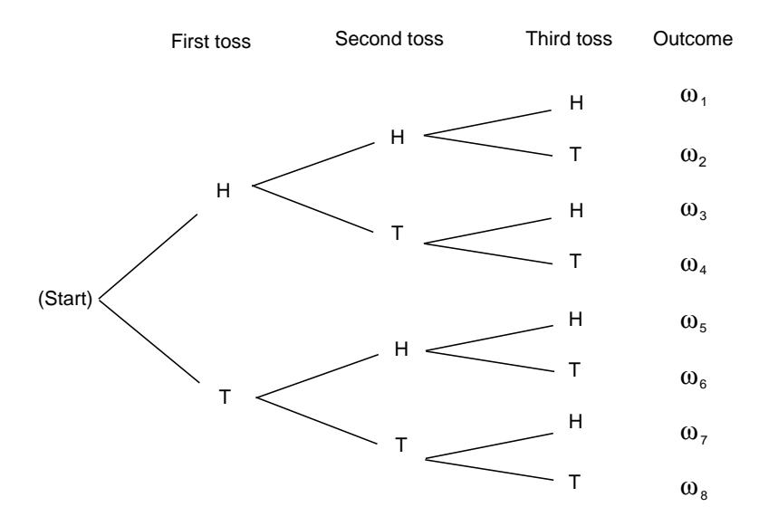
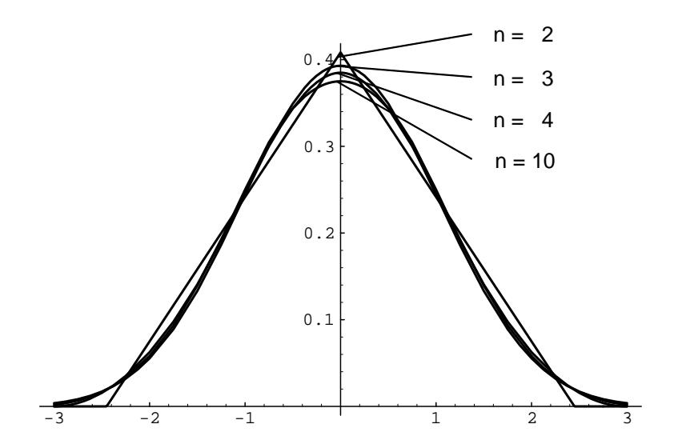

## Contents

| Preface vii |                                                                                                                                                                                                                                             |                   |  |  |  |
|----------------|---------------------------------------------------------------------------------------------------------------------------------------------------------------------------------------------------------------------------------------------|-------------------|--|--|--|
| 1.             | <b>Discrete Probability Distributions</b> Simulation of Discrete Probabilities 1.1 Discrete Probability Distributions 1.2 18                                                                                                 | 1 $\mathbf{1}$ |  |  |  |
| $\bf{2}$       | <b>Continuous Probability Densities</b> 41 Simulation of Continuous Probabilities 41 2.1 2.2 Continuous Density Functions 55                                                                                           |                   |  |  |  |
| 3              | Combinatorics 75 Permutations 3.1 75 3.2 Combinations 92 3.3 Card Shuffling                                                                                                                                      |                   |  |  |  |
| 4              | 133 <b>Conditional Probability</b> 4.1 Discrete Conditional Probability 133 Continuous Conditional Probability 4.2 4.3 Paradoxes                                                                                    |                   |  |  |  |
| 5              | 183 <b>Distributions and Densities</b> Important Distributions 5.1 5.2 Important Densities                                                                                                                                   |                   |  |  |  |
| 6              | <b>Expected Value and Variance</b> 225 Expected Value $\ldots \ldots \ldots \ldots \ldots \ldots \ldots \ldots \ldots \ldots \ldots$ 6.1 Variance of Discrete Random Variables 257 6.2 6.3 Continuous Random Variables |                   |  |  |  |
| 7              | <b>Sums of Random Variables</b> 285 Sums of Discrete Random Variables  285 7.1 7.2 Sums of Continuous Random Variables 291                                                                                                   |                   |  |  |  |
| 8              | Law of Large Numbers 305 Discrete Random Variables 8.1 Continuous Random Variables 8.2 -316                                                                                                                               |                   |  |  |  |

 $\mathbf{V}$ 

## $CONTENTS$

| 9                              | Central Limit Theorem 325 |                                                                                            |  |  |  |  |  |  |  |
|--------------------------------|------------------------------|--------------------------------------------------------------------------------------------|--|--|--|--|--|--|--|
|                                | 9.1                          | Bernoulli Trials                                                                           |  |  |  |  |  |  |  |
|                                | 9.2                          | Discrete Independent Trials                                                                |  |  |  |  |  |  |  |
|                                | 9.3                          | Continuous Independent Trials                                                              |  |  |  |  |  |  |  |
| 10 Generating Functions 365 |                              |                                                                                            |  |  |  |  |  |  |  |
|                                |                              | 10.1 Discrete Distributions                                                                |  |  |  |  |  |  |  |
|                                |                              | 10.2 Branching Processes                                                                   |  |  |  |  |  |  |  |
|                                |                              | 10.3 Continuous Densities                                                                  |  |  |  |  |  |  |  |
| 11 Markov Chains 405        |                              |                                                                                            |  |  |  |  |  |  |  |
|                                |                              | 11.1 Introduction                                                                          |  |  |  |  |  |  |  |
|                                |                              | 11.2 Absorbing Markov Chains                                                               |  |  |  |  |  |  |  |
|                                |                              | 11.3 Ergodic Markov Chains                                                                 |  |  |  |  |  |  |  |
|                                |                              | 11.4 Fundamental Limit Theorem                                                             |  |  |  |  |  |  |  |
|                                |                              | 11.5 Mean First Passage Time                                                               |  |  |  |  |  |  |  |
| 12 Random Walks 471         |                              |                                                                                            |  |  |  |  |  |  |  |
|                                |                              | 12.1 Random Walks in Euclidean Space $\dots \dots \dots \dots \dots \dots \dots \dots$ 471 |  |  |  |  |  |  |  |
|                                |                              | 12.2 Gambler's Ruin                                                                        |  |  |  |  |  |  |  |
|                                |                              | 12.3 Arc Sine Laws                                                                         |  |  |  |  |  |  |  |
| Appendices 499              |                              |                                                                                            |  |  |  |  |  |  |  |
| Index                          |                              |                                                                                            |  |  |  |  |  |  |  |

 $_{\rm{vi}}$ 

## Preface

Probability theory began in seventeenth century France when the two great French mathematicians, Blaise Pascal and Pierre de Fermat, corresponded over two problems from games of chance. Problems like those Pascal and Fermat solved continued to influence such early researchers as Huygens, Bernoulli, and DeMoivre in establishing a mathematical theory of probability. Today, probability theory is a wellestablished branch of mathematics that finds applications in every area of scholarly activity from music to physics, and in daily experience from weather prediction to predicting the risks of new medical treatments.

This text is designed for an introductory probability course taken by sophomores, juniors, and seniors in mathematics, the physical and social sciences, engineering, and computer science. It presents a thorough treatment of probability ideas and techniques necessary for a firm understanding of the subject. The text can be used in a variety of course lengths, levels, and areas of emphasis.

For use in a standard one-term course, in which both discrete and continuous probability is covered, students should have taken as a prerequisite two terms of calculus, including an introduction to multiple integrals. In order to cover Chapter 11, which contains material on Markov chains, some knowledge of matrix theory is necessary.

The text can also be used in a discrete probability course. The material has been organized in such a way that the discrete and continuous probability discussions are presented in a separate, but parallel, manner. This organization dispels an overly rigorous or formal view of probability and offers some strong pedagogical value in that the discrete discussions can sometimes serve to motivate the more abstract continuous probability discussions. For use in a discrete probability course, students should have taken one term of calculus as a prerequisite.

Very little computing background is assumed or necessary in order to obtain full benefits from the use of the computing material and examples in the text. All of the programs that are used in the text have been written in each of the languages TrueBASIC, Maple, and Mathematica.

This book is distributed on the Web as part of the Chance Project, which is devoted to providing materials for beginning courses in probability and statistics. The computer programs, solutions to the odd-numbered exercises, and current errata are also available at this site. Instructors may obtain all of the solutions by writing to either of the authors, at jlsnell@dartmouth.edu and cgrinst1@swarthmore.edu.

vii

PREFACE

viii

### **FEATURES**

Level of rigor and emphasis: Probability is a wonderfully intuitive and applicable field of mathematics. We have tried not to spoil its beauty by presenting too much formal mathematics. Rather, we have tried to develop the key ideas in a somewhat leisurely style, to provide a variety of interesting applications to probability, and to show some of the nonintuitive examples that make probability such a lively subject.

*Exercises:* There are over 600 exercises in the text providing plenty of opportunity for practicing skills and developing a sound understanding of the ideas. In the exercise sets are routine exercises to be done with and without the use of a computer and more theoretical exercises to improve the understanding of basic concepts. More difficult exercises are indicated by an asterisk. A solution manual for all of the exercises is available to instructors.

*Historical remarks:* Introductory probability is a subject in which the fundamental ideas are still closely tied to those of the founders of the subject. For this reason, there are numerous historical comments in the text, especially as they deal with the development of discrete probability.

*Pedagogical use of computer programs:* Probability theory makes predictions about experiments whose outcomes depend upon chance. Consequently, it lends itself beautifully to the use of computers as a mathematical tool to simulate and analyze chance experiments.

In the text the computer is utilized in several ways. First, it provides a laboratory where chance experiments can be simulated and the students can get a feeling for the variety of such experiments. This use of the computer in probability has been already beautifully illustrated by William Feller in the second edition of his famous text An Introduction to Probability Theory and Its Applications (New York: Wiley, 1950). In the preface, Feller wrote about his treatment of fluctuation in coin tossing: "The results are so amazing and so at variance with common intuition that even sophisticated colleagues doubted that coins actually misbehave as theory predicts. The record of a simulated experiment is therefore included."

In addition to providing a laboratory for the student, the computer is a powerful aid in understanding basic results of probability theory. For example, the graphical illustration of the approximation of the standardized binomial distributions to the normal curve is a more convincing demonstration of the Central Limit Theorem than many of the formal proofs of this fundamental result.

Finally, the computer allows the student to solve problems that do not lend themselves to closed-form formulas such as waiting times in queues. Indeed, the introduction of the computer changes the way in which we look at many problems in probability. For example, being able to calculate exact binomial probabilities for experiments up to 1000 trials changes the way we view the normal and Poisson approximations.

### **ACKNOWLEDGMENTS**

Anyone writing a probability text today owes a great debt to William Feller, who taught us all how to make probability come alive as a subject matter. If you

## Chapter 1

# **Discrete Probability Distributions**

#### $1.1$ **Simulation of Discrete Probabilities**

## Probability

In this chapter, we shall first consider chance experiments with a finite number of possible outcomes  $\omega_1, \omega_2, \ldots, \omega_n$ . For example, we roll a die and the possible outcomes are  $1, 2, 3, 4, 5, 6$  corresponding to the side that turns up. We toss a coin with possible outcomes H (heads) and T (tails).

It is frequently useful to be able to refer to an outcome of an experiment. For example, we might want to write the mathematical expression which gives the sum of four rolls of a die. To do this, we could let  $X_i$ ,  $i = 1, 2, 3, 4$ , represent the values of the outcomes of the four rolls, and then we could write the expression

$$
X_1 + X_2 + X_3 + X_4
$$

for the sum of the four rolls. The  $X_i$ 's are called *random variables*. A random variable is simply an expression whose value is the outcome of a particular experiment. Just as in the case of other types of variables in mathematics, random variables can take on different values.

Let  $X$  be the random variable which represents the roll of one die. We shall assign probabilities to the possible outcomes of this experiment. We do this by assigning to each outcome  $\omega_i$  a nonnegative number  $m(\omega_i)$  in such a way that

$$
m(\omega_1)+m(\omega_2)+\cdots+m(\omega_6)=1.
$$

The function  $m(\omega_j)$  is called the *distribution function* of the random variable X. For the case of the roll of the die we would assign equal probabilities or probabilities  $1/6$  to each of the outcomes. With this assignment of probabilities, one could write

$$
P(X\leq 4)=\frac{2}{3}
$$

 $\mathbf{1}$ 

1.1. SIMULATION OF DISCRETE PROBABILITIES

 $\sqrt{3}$ 

| .203309 | .762057 | .151121 | .623868 |
|---------|---------|---------|---------|
| .932052 | .415178 | .716719 | .967412 |
| .069664 | .670982 | .352320 | .049723 |
| .750216 | .784810 | .089734 | .966730 |
| .946708 | .380365 | .027381 | .900794 |

### Table 1.1: Sample output of the program **RandomNumbers**.

Let X be a random variable with distribution function  $m(\omega)$ , where  $\omega$  is in the set  $\{\omega_1, \omega_2, \omega_3\}$ , and  $m(\omega_1) = 1/2$ ,  $m(\omega_2) = 1/3$ , and  $m(\omega_3) = 1/6$ . If our computer package can return a random integer in the set  $\{1, 2, ..., 6\}$ , then we simply ask it to do so, and make 1, 2, and 3 correspond to  $\omega_1$ , 4 and 5 correspond to  $\omega_2$ , and 6 correspond to  $\omega_3$ . If our computer package returns a random real number r in the interval  $(0, 1)$ , then the expression

$$
\lfloor 6r \rfloor + 1
$$

will be a random integer between 1 and 6. (The notation  $|x|$  means the greatest integer not exceeding x, and is read "floor of  $x$ .")

The method by which random real numbers are generated on a computer is described in the historical discussion at the end of this section. The following example gives sample output of the program **RandomNumbers**.

**Example 1.1** (Random Number Generation) The program **RandomNumbers** generates *n* random real numbers in the interval [0, 1], where *n* is chosen by the user. When we ran the program with  $n = 20$ , we obtained the data shown in Table 1.1.  $\Box$ 

**Example 1.2** (Coin Tossing) As we have noted, our intuition suggests that the probability of obtaining a head on a single toss of a coin is  $1/2$ . To have the computer toss a coin, we can ask it to pick a random real number in the interval  $[0,1]$  and test to see if this number is less than  $1/2$ . If so, we shall call the outcome heads; if not we call it tails. Another way to proceed would be to ask the computer to pick a random integer from the set  $\{0,1\}$ . The program **CoinTosses** carries out the experiment of tossing a coin n times. Running this program, with  $n = 20$ , resulted in:

## ТНТТТНТТТТНТТТТННТТ.

Note that in 20 tosses, we obtained 5 heads and 15 tails. Let us toss a coin  $n$ times, where  $n$  is much larger than 20, and see if we obtain a proportion of heads closer to our intuitive guess of  $1/2$ . The program **CoinTosses** keeps track of the number of heads. When we ran this program with  $n = 1000$ , we obtained 494 heads. When we ran it with  $n = 10000$ , we obtained 5039 heads.

1.2. DISCRETE PROBABILITY DISTRIBUTIONS

25

Figure 1.8: Tree diagram for three tosses of a coin.

Let  $A$  be the event "the first outcome is a head," and  $B$  the event "the second" outcome is a tail." By looking at the paths in Figure 1.8, we see that

$$
P(A) = P(B) = \frac{1}{2}.
$$

Moreover,  $A \cap B = {\omega_3, \omega_4}$ , and so  $P(A \cap B) = 1/4$ . Using Theorem 1.4, we obtain

$$
P(A \cup B) = P(A) + P(B) - P(A \cap B)
$$
  
=  $\frac{1}{2} + \frac{1}{2} - \frac{1}{4} = \frac{3}{4}$ .

Since  $A \cup B$  is the 6-element set,

$$
A \cup B = \{HHH, HHT, HTH, HTT, TTH, TTT\},
$$

we see that we obtain the same result by direct enumeration.

 $\Box$ 

In our coin tossing examples and in the die rolling example, we have assigned an equal probability to each possible outcome of the experiment. Corresponding to this method of assigning probabilities, we have the following definitions.

## **Uniform Distribution**

**Definition 1.3** The *uniform distribution* on a sample space  $\Omega$  containing *n* elements is the function  $m$  defined by

$$
m(\omega) = \frac{1}{n}
$$

for every  $\omega \in \Omega$ .

 $\Box$ 

2.1. SIMULATION OF CONTINUOUS PROBABILITIES

51

|                   |        | Length of Number of Number of |           | Estimate  |
|-------------------|--------|-------------------------------|-----------|-----------|
| Experimenter      | needle | casts                         | crossings | for $\pi$ |
| Wolf, 1850        | .8     | 5000                          | 2532      | 3.1596    |
| Smith, 1855       | .6     | 3204                          | 1218.5    | 3.1553    |
| De Morgan, c.1860 | 1.0    | 600                           | 382.5     | 3.137     |
| Fox, 1864         | .75    | 1030                          | 489       | 3.1595    |
| Lazzerini, 1901   | .83    | 3408                          | 1808      | 3.1415929 |
| Reina, 1925       | .5419  | 2520                          | 869       | 3.1795    |

Table 2.1: Buffon needle experiments to estimate  $\pi$ .

presented a number of mortality tables and used them to compute, for each age group, the expected remaining lifetime. From his table he observed: the expected remaining lifetime of an infant of one year is 33 years, while that of a man of 21 years is also approximately 33 years. Thus, a father who is not yet 21 can hope to live longer than his one year old son, but if the father is 40, the odds are already 3 to 2 that his son will outlive him.6

Buffon wanted to show that not all probability calculations rely only on algebra, but that some rely on geometrical calculations. One such problem was his famous "needle problem" as discussed in this chapter.7 In his original formulation, Buffon describes a game in which two gamblers drop a loaf of French bread on a wide-board floor and bet on whether or not the loaf falls across a crack in the floor. Buffon asked: what length  $L$  should the bread loaf be, relative to the width  $W$  of the floorboards, so that the game is fair. He found the correct answer  $(L = (\pi/4)W)$ using essentially the methods described in this chapter. He also considered the case of a checkerboard floor, but gave the wrong answer in this case. The correct answer was given later by Laplace.

The literature contains descriptions of a number of experiments that were actually carried out to estimate  $\pi$  by this method of dropping needles. N. T. Gridgeman8 discusses the experiments shown in Table 2.1. (The halves for the number of crossing comes from a compromise when it could not be decided if a crossing had actually occurred.) He observes, as we have, that 10,000 casts could do no more than establish the first decimal place of  $\pi$  with reasonable confidence. Gridgeman points out that, although none of the experiments used even 10,000 casts, they are surprisingly good, and in some cases, too good. The fact that the number of casts is not always a round number would suggest that the authors might have resorted to clever stopping to get a good answer. Gridgeman comments that Lazzerini's estimate turned out to agree with a well-known approximation to  $\pi$ ,  $355/113 = 3.1415929$ , discovered by the fifth-century Chinese mathematician, Tsu Ch'ungchih. Gridgeman says that he did not have Lazzerini's original report, and while waiting for it (knowing

&lt;sup>6G. L. Buffon, "Essai d'Arithmétique Morale," p. 301.

 $7$ ibid., pp. 277-278.

&lt;sup>8N. T. Gridgeman, "Geometric Probability and the Number  $\pi$ " Scripta Mathematika, vol. 25, no. 3, (1960), pp. 183–195.

9.3. CONTINUOUS INDEPENDENT TRIALS

357

Figure 9.13: Density function for  $S_n^*$  (uniform case,  $n = 2, 3, 4, 10$ ).

$$
\mu = E(X_i) = \frac{1}{\lambda},
$$
  
$$
\sigma^2 = V(X_j) = \frac{1}{\lambda^2}.
$$

Here we know the density function for  $S_n$  explicitly (see Section 7.2). We can use Corollary 5.1 to calculate the density function for  $S_n^*$ . We obtain

$$
f_{S_n}(x) = \frac{\lambda e^{-\lambda x} (\lambda x)^{n-1}}{(n-1)!},
$$
  
$$
f_{S_n^*}(x) = \frac{\sqrt{n}}{\lambda} f_{S_n} \left( \frac{\sqrt{n} x + n}{\lambda} \right)
$$

The graph of the density function for  $S_n^*$  is shown in Figure 9.14.

 $\Box$ 

These examples make it seem plausible that the density function for the normalized random variable  $S_n^*$  for large *n* will look very much like the normal density with mean  $0$  and variance  $1$  in the continuous case as well as in the discrete case. The Central Limit Theorem makes this statement precise.

## **Central Limit Theorem**

**Theorem 9.6 (Central Limit Theorem)** Let  $S_n = X_1 + X_2 + \cdots + X_n$  be the sum of  $n$  independent continuous random variables with common density function  $p$ having expected value  $\mu$  and variance  $\sigma^2$ . Let  $S_n^* = (S_n - n\mu)/\sqrt{n}\sigma$ . Then we have,